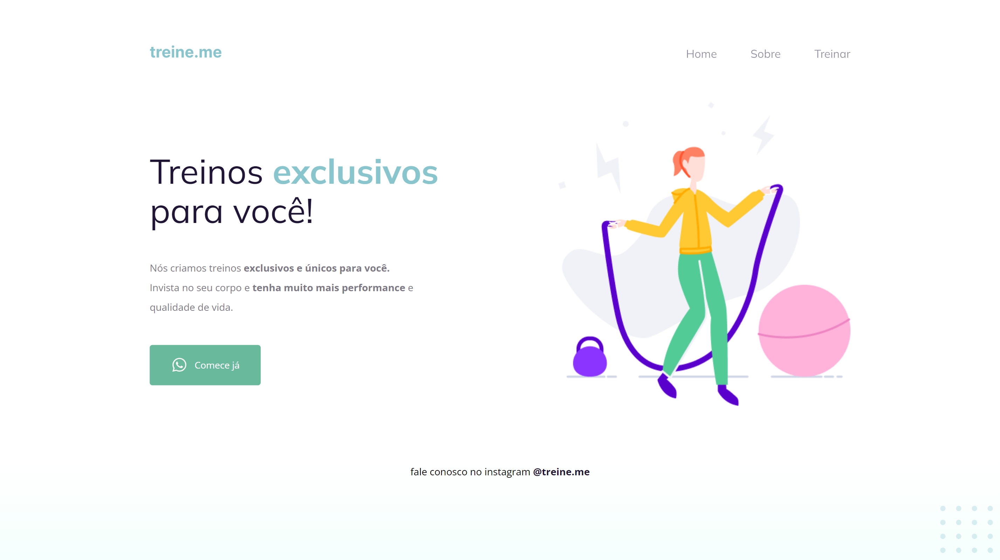

<h1 align="center"> PROJETO DA FORMAÇÃO FULL-STACK DA ROCKETSEAT </h1>

Projeto construído para fins de aprendizado  

  <a href="#-tecnologias">Tecnologias</a>&nbsp;&nbsp;&nbsp;|&nbsp;&nbsp;&nbsp;

 

 

 

## 👾 Tecnologias

Esse projeto foi desenvolvido com as seguintes tecnologias:

- HTML e CSS
- Git e Github
- Figma
